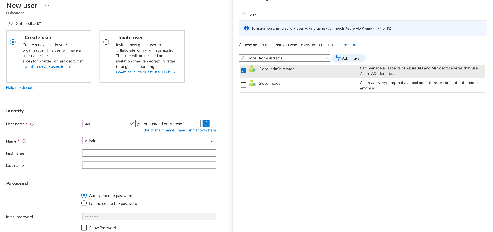
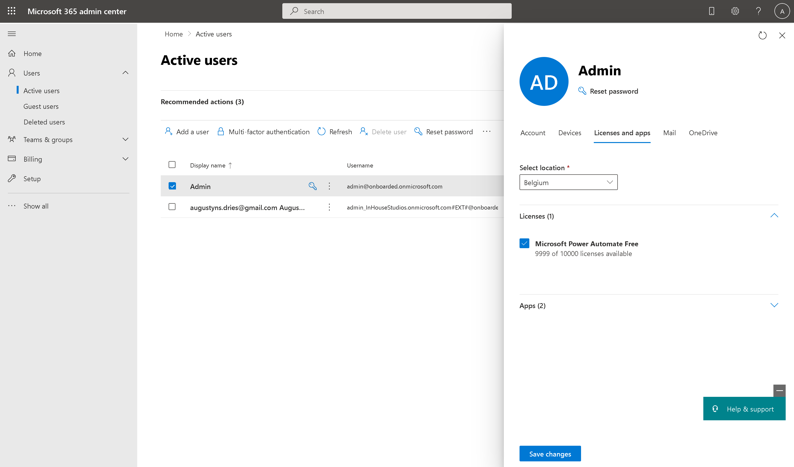

# Setup
Before we can get started with this demo, we need to go through some basic setup first.

**It is very important that you use your personal Microsoft account for this hands-on lab!**

## Claiming your Azure Pass
- Find the Azure Pass Code that we have linked with your account
- Navigate to the [Azure Pass Portal](https://www.microsoftazurepass.com) and claim your code

## Setting up Azure
- Navigate to the [Azure Portal](https://portal.azure.com) and find the Azure Active Directory service.
- Add a new user and give it Global Administrator permissions.
- Take note of the auto-generated password by Azure or create your own one 

## Starting Power Platform Demo
- Navigate to the [Microsoft Admin Panel](https://admin.microsoft.com) and sign in with the user you just created
- In the "Users" menu, find the "Active users" tab, look for the user you just created and open its profile
- Navigate to the Licenses and apps tab, this may take some time to load in, once it is loaded assign one of the "Microsoft Power Automate Free" licenses to this account

Once you have completed this step, your new user will have access to Power Automate. If you want to experiment with any of the premium capabilities of Power Automate during this hands-on lab, then you are free to start the 90 day free trial available to your account.

Continue to [Setting up IoT Central](./03_Setting_Up_IoT_Central.md)
