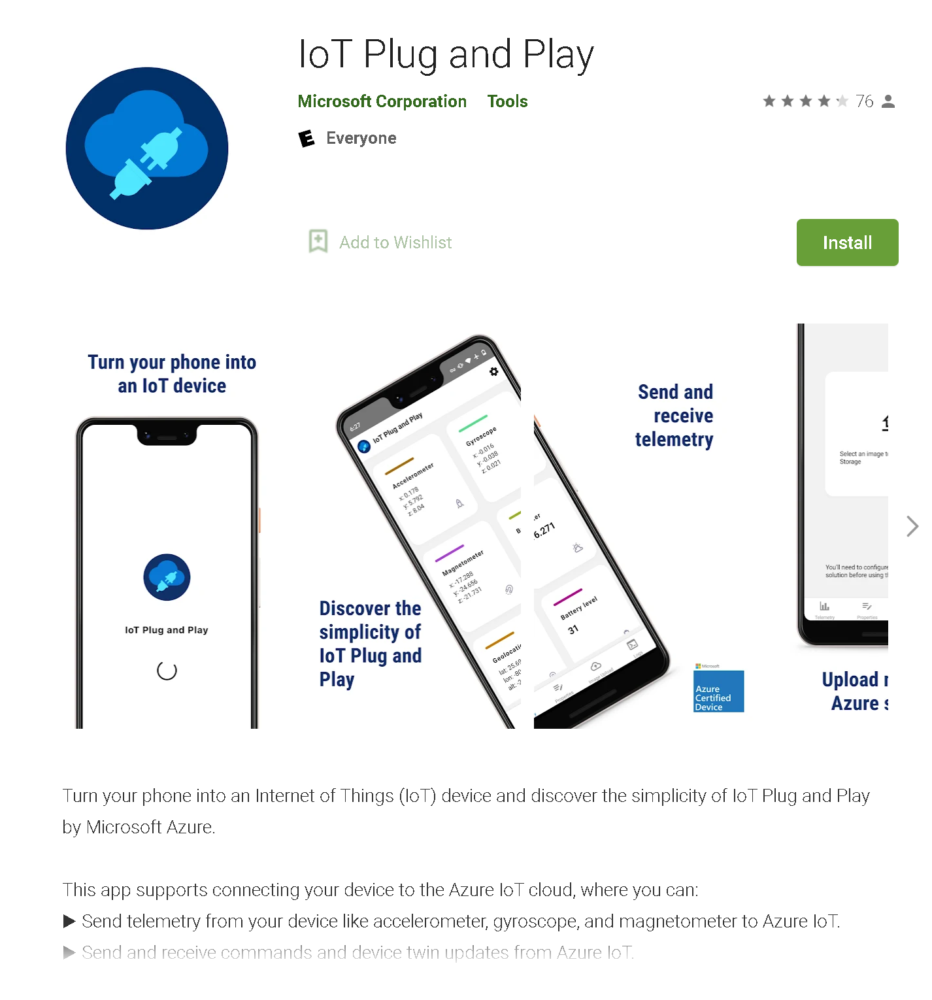

# Setting Up IoT Plug-n-Play App
The Azure IoT Plug-n-Play app is a very simple mobile application that is perfect for simple experiments with Azure IoT. It requires almost no setup meaning you can get started insanely quick.

## Prerequisites
- A smartphone with an internet connection

## Setting Up
- Take your smartphone and navigate to the app store
- Download the IoT Plug and Play app

- Open the app and you will be prompted to scan a QR code, you can find it in the device tab of our newly created device.
- Go to IoT Central, open your device and select the "Connect" tab. Instead of "Key", select "QR Code" and scan it with the IoT Plug-n-Play app.

## What have you learned so far
- Setting up an IoT Central application
- Connecting a smartphone to Azure IoT

Continue to [Verifying](./05_Verifying.md)