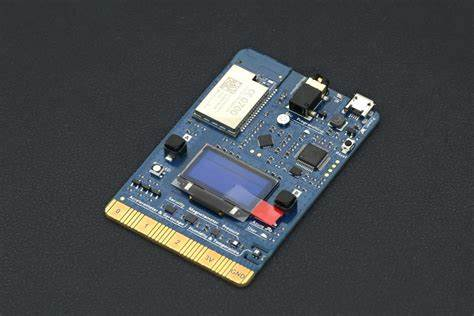
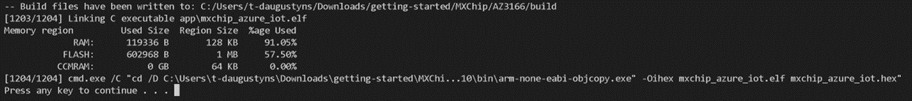

# Setting Up MXChip
The Azure MXChip IoT DevKit is the perfect solution to develop and protoype IoT solutions. With its many onboard functionalities and flexibile source code, you can create almost any solution you wish to try.

## Prerequisites
- An Azure MXChip IoT DevKit
- A PC with Git and Admin access

## Setting Up
- Clone this repository to your device if you haven't done that already and open it in an editor like VS Code.
- To get this working, we will need to perform some basic coding but don't worry. Almost everything you need is already present in this repository.
- Start by installing the build tools. To do this, run the following script `./source/tools/get-toolchain.bat`.
- Navigate to your IoT Central application, find your device and click on connect. 
Take note of the following fields: 
    - ID Scope
    - Device ID
    - Primary Key
- Now we just need to configure our connection variables. You can find them in the following file `./source/MXChip/AZ3166/app/azure_config.h`.
    - WIFI_SSID, the name of the WIFI network you wish to use
    - WIFI_PASSWORD, the password for the WIFI network
    - IOT_DPS_ID_SCOPE, the scope ID you copied earlier
    - IOT_DPS_REGISTRATION_ID, the device ID you copied earlier
    - IOT_DEVICE_SAS_KEY, the primary key you copied earlier
- Save that file and rebuild the source code by running the following script `./source/MXChip/AZ3166/tools/rebuild.bat`

- Connect your Azure MXChip to your computer with the provided USB-cable, it will show up as a removable drive your explorer.
- Drag the output .bin-file of our build to the MXChip, it will most likely be in `./srouce/MXChip/Az3166/build`, this can be verified by looking at the output from the command.
- Your device will start to flash the image and restart, you can verify that device is writing the image by the flashing LED-light on the chip.

## What have you learned so far
- Setting up an IoT Central application
- Configuring an Azure MXChip to use the parameters we provide
- Reflash an MXChip

Continue to [Verifying](./05_Verifying.md)