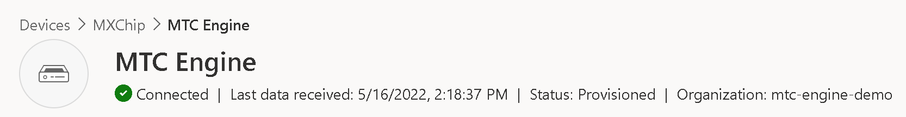

# Verifying
We have now connected our device to IoT Central. Before we can continue we need to check if we have done this correctly.

- Navigate to your IoT Central application and open the device you created
- If everything went well, you should see that our device is now showing as connected and sending through telemetry

## What have you learned so far
- Verifying the connection of an IoT device to IoT Central

Continue to [Power Platform](./06_PowerPlatform.md)