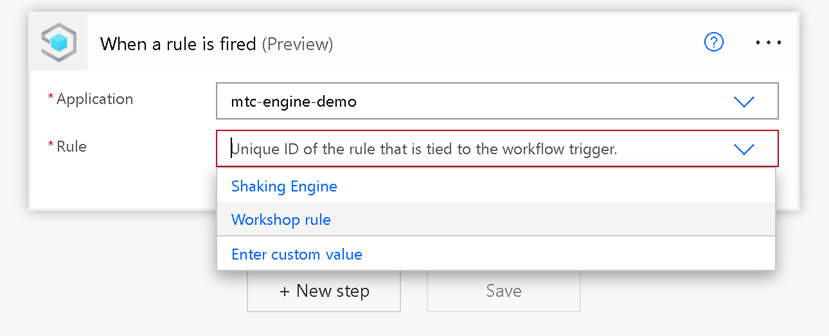
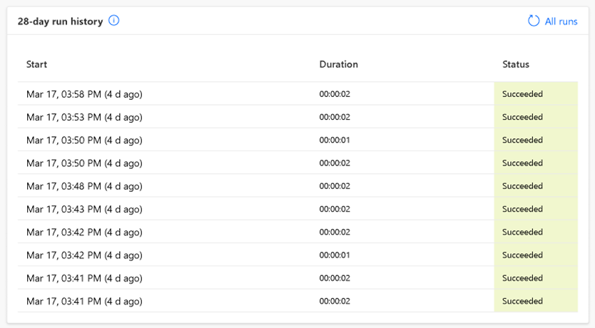

# Connecting to Power Platform
Now we are going to unleash some real power, by connecting IoT Central to Power Platform we can create automated flows and low-code applications that can interact with our IoT setup.

## Creating a rule
Rules are created in IoT Central and are triggered when a certain treshold is met. They can perform a variety of actions like triggering a webhook or Power Automate Flow.

- Navigate to your IoT Central application and find the rules tab
- Create a new rule, give it a name and select the device template of your newly created device
- Create a condition that you can easily trigger like the temperature or the gyroscope of your device

**Press save before continuing**

- Scroll down to "Actions" and select Microsoft Power Automate, this will create a new Power Automate flow

## Creating a Power Automate Flow
- You can either pick a template or create your own flow from scratch. Don't worry, all the tight integrations between Microsoft services make sure that most fields are automatically filled in!

- Try adding a new step to your flow, if this is your first time working with Power Automate then some of these steps are a good components!
    - Send an email (V2) by Office 365 Outlook
    - Post message in chat or channel by Microsoft Teams

## Running our flow
Since we have linked our Power Automate Flow to our IoT Central rule, we will need to trigger that rule and our flow will automatically run for us.

- Try to trigger your IoT Central rule

If you can't get your flow to run and need to perform some debugging then these are crucial steps to follow.
- Open your device in IoT Central and look at the telemetry. Maybe the temperature is slightly too low or you are not tilting your device enough
- Open your flow in Power Automate and look at the run history, is it running with errors or not running at all?

## What have you learned so far
- Creating rules in IoT Central
- Creating Power Automate flows
- Verifying the status and condition of Power Automate flows

Continue to [Extra Challenges](./07_Challenges.md)