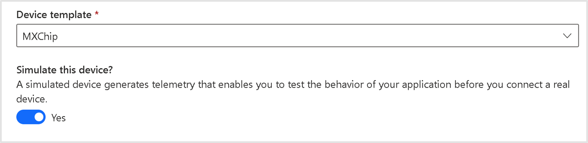
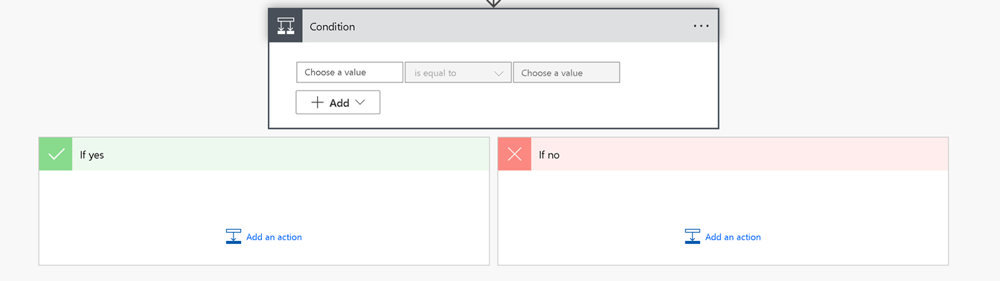
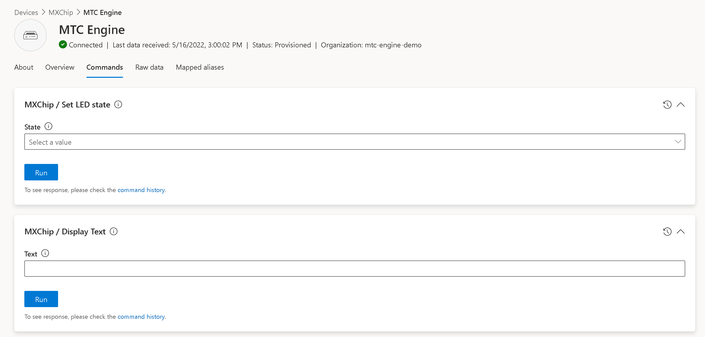

# Extra Challenges
You succesfully made your way through our demo but don't worry because we have got plenty of challenges prepared for you! 
You don't have to do all of them, pick the ones you find most interesting!

## IoT Central Dashboarding
Inside of IoT Central you create custom dashboards based on the devices that are linked to the application. Try to create a real-time dashboard that gives you a great overview of how your device is performing.

## Simulated Devices
Setting up a complicated IoT Setup with multiple devices can be a difficult task. IoT Central allows you to add simulated devices based on physicals ones you already have. They will be sending out similair data meaning you can easily create multi-device setups. Try adding a couple of simulated devices and see how it affects your creation.

## Control blocks in Power Automate
Power Automate does not only contain actions, it also has control blocks that you can use to filter and perform certain actions. Blocks like "Condition" and "Switch" allow you to split up your flow. Try to create a more complicated Power Automate setup.

Some examples:
- Send an email if the temperature is over 20 degrees, but send a teams message if it is over 25 degrees.
- Add a simulated device and do nothing if the rule was triggered by your simulated device but send an email if it was triggered by your real device.

## Device Commands
**Only possible if you are using a physical MXChip**

Devices in IoT Central can send commands to IoT Devices. As you may have noticed the MXChip has a screen that can display text.

Navigate to your device and find the "Commands" menu. Use it to trigger a command. If you can successfully display text on your MXChip, try to trigger a command from inside your Power Automate Flow. The action you are looking for is part of Azure IoT Central V3 and is called "Run a device command (preview)". You will need your device ID for this, you can find it as a column in the devices table.

